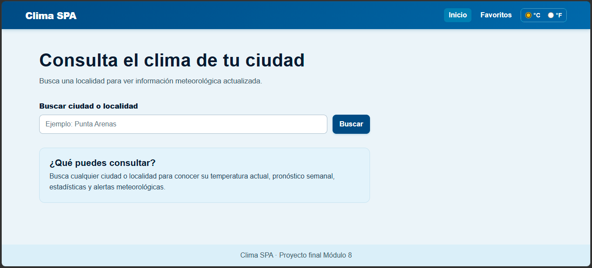
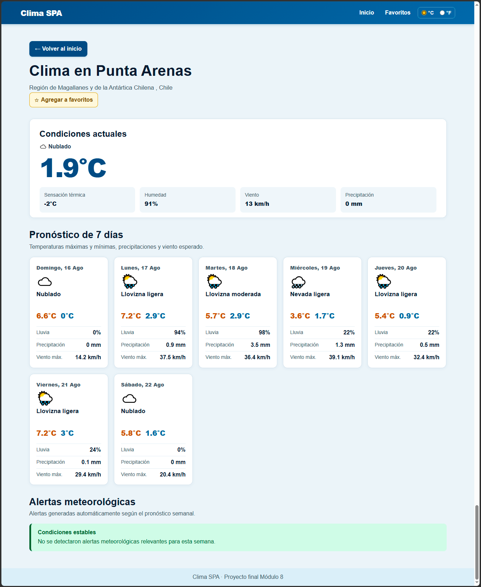
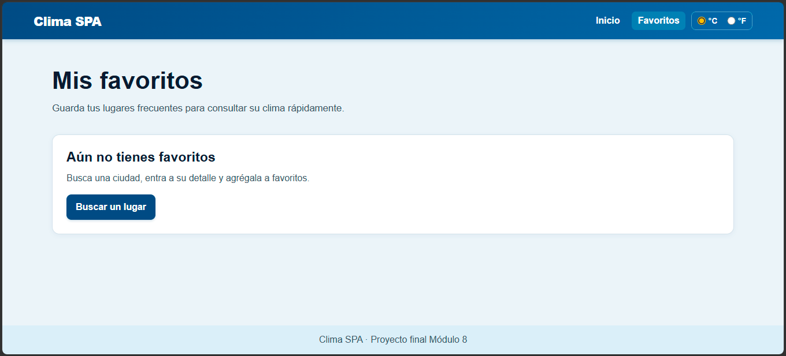

# Clima SPA

Aplicación meteorológica desarrollada como proyecto final del Módulo 8. Permite buscar ciudades, consultar información del clima en tiempo real, revisar un pronóstico semanal, visualizar estadísticas y alertas meteorológicas, cambiar la unidad de temperatura y gestionar lugares favoritos.

## Demo y repositorio

- Repositorio: [GitHub - m8-proy-final-clima-vuex](https://github.com/zakkdruzer/m8-proy-final-clima-vuex)
- Demo: [Ver aplicación publicada](https://zakkdruzer.github.io/m8-proy-final-clima-vuex/)

## Características

- SPA creada con Vue 3 y Vite.
- Navegación con Vue Router.
- Estado global con Vuex.
- Búsqueda de ciudades y localidades.
- Consulta de clima actual mediante una API externa.
- Pronóstico meteorológico para 7 días.
- Estadísticas semanales:
  - Temperatura mínima.
  - Temperatura máxima.
  - Temperatura promedio.
  - Conteo de días lluviosos.
  - Conteo de días despejados.
  - Conteo de días nublados.
- Alertas meteorológicas generadas mediante reglas:
  - Posible ola de calor.
  - Semana lluviosa.
  - Riesgo de heladas.
  - Vientos fuertes.
  - Condiciones estables.
- Cambio entre grados Celsius y Fahrenheit.
- Favoritos persistentes mediante LocalStorage.
- Persistencia del último lugar consultado y sus datos meteorológicos.
- Mensajes de carga, validación, errores y opción de reintento.
- Página 404 para rutas inexistentes.
- Diseño adaptable a móvil, tablet y escritorio.

## Tecnologías

- Vue 3
- Vite
- Vue Router
- Vuex
- Axios
- JavaScript
- CSS
- Git y GitHub Pages

## API utilizada

La aplicación utiliza [Open-Meteo](https://open-meteo.com/) para obtener información meteorológica.

- [Geocoding API](https://open-meteo.com/en/docs/geocoding-api): busca ciudades y obtiene sus coordenadas.
- [Forecast API](https://open-meteo.com/en/docs): consulta clima actual y pronóstico semanal.

La API no requiere una clave para este proyecto.

## Requisitos

- Node.js 18 o superior.
- npm 9 o superior.
- Conexión a internet para consultar la API meteorológica.

## Instalación local

1. Clona el repositorio:

   ```bash
   git clone https://github.com/zakkdruzer/m8-proy-final-clima-vuex.git
   ```

2. Entra a la carpeta del proyecto:

   ```bash
   cd m8-proy-final-clima-vuex
   ```

3. Instala las dependencias:

   ```bash
   npm install
   ```

4. Ejecuta el servidor de desarrollo:

   ```bash
   npm run dev
   ```

5. Abre la dirección mostrada por Vite, normalmente:

   ```text
   http://localhost:5173/
   ```

## Scripts disponibles

| Comando | Descripción |
|---|---|
| `npm run dev` | Inicia el servidor de desarrollo |
| `npm run build` | Genera el build de producción en `dist` |
| `npm run preview` | Sirve localmente el build de producción |
| `npm run deploy` | Publica el contenido de `dist` en GitHub Pages |

## Rutas de la aplicación

| Ruta | Descripción |
|---|---|
| `/` | Inicio: búsqueda y listado de lugares |
| `/lugar/:id` | Detalle: clima actual, pronóstico, estadísticas y alertas |
| `/favoritos` | Lugares guardados por el usuario |
| `/:pathMatch(.*)*` | Página 404 para rutas inexistentes |

## Estructura del proyecto

```text
src/
├── docs/           # Capturas
├── components/     # Componentes reutilizables
├── router/         # Configuración de Vue Router
├── services/       # Cliente Axios y adaptadores de Open-Meteo
├── store/          # Estado global Vuex
├── utils/          # Códigos WMO, estadísticas y alertas
├── views/          # Vistas principales
├── App.vue
├── main.js
└── style.css
```

## Variables de entorno

Actualmente el proyecto no requiere variables de entorno porque Open-Meteo no utiliza API key para los endpoints consultados.

Si en el futuro se utiliza una API con credenciales, se debe crear un archivo `.env` basado en `.env.example` y nunca subirlo al repositorio.

## Capturas







## Autor

Proyecto realizado por [José](https://github.com/zakkdruzer) como entrega final del Módulo 8 del Bootcamp Front-end.